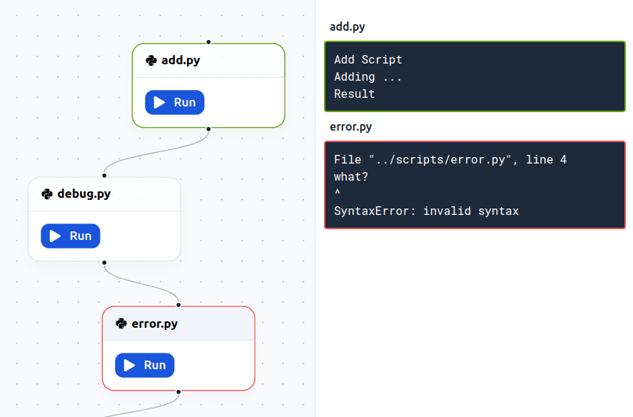

# Visual Node Pipeline



## Install

```bash
git clone git@github.com:juanitoddd/flow-runner.git 
cd flow-runner
# Frontend
cd frontend && npm i
# API
cd api && npm i
```

## Run frontend & API

```bash
# Frontend
cd frontend && npm run dev
# API
cd api && npm run dev
```

## Python scripts
Add python files in the ```scripts``` folder.
```bash
cd scripts
touch script.py
```

#### open http://localhost:5173/

